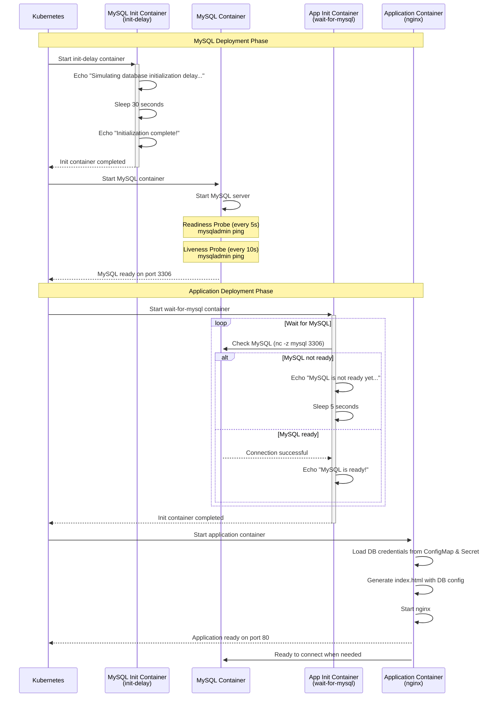

# Kubernetes Init Container Demo - Sequential Microservices Startup

This demo demonstrates how to use Kubernetes init containers to ensure proper sequential startup of microservices, where an application waits for a database to be fully ready before starting.

## Overview

The demo creates two deployments:
1. **MySQL Database** - with an init container that simulates initialization delay
2. **Application (nginx)** - with an init container that waits for MySQL to be ready

## Architecture Diagram



## Component Details

### 1. MySQL Deployment (1.mysql-deployment.yaml)

**Resources Created:**
- **ConfigMap** (`mysql-config`): Stores database name
- **Secret** (`mysql-secret`): Stores root and app passwords
- **Service** (`mysql`): ClusterIP service on port 3306
- **Deployment** (`mysql`): MySQL 8.0 with init container

**Init Container:**
- **Name**: `init-delay`
- **Purpose**: Simulates database initialization delay
- **Duration**: 30 seconds
- **Image**: busybox:1.36

**Main Container:**
- **Image**: mysql:8.0
- **Environment Variables**: 
  - `MYSQL_ROOT_PASSWORD` (from Secret)
  - `MYSQL_DATABASE` (from ConfigMap)
  - `MYSQL_USER`: appuser
  - `MYSQL_PASSWORD` (from Secret)
- **Readiness Probe**: Checks every 5s (initial delay: 10s)
- **Liveness Probe**: Checks every 10s (initial delay: 30s)

### 2. Application Deployment (2.app-deployment.yaml)

**Resources Created:**
- **Deployment** (`myapp`): nginx-based application
- **Service** (`myapp`): LoadBalancer on port 80

**Init Container:**
- **Name**: `wait-for-mysql`
- **Purpose**: Ensures MySQL is accessible before app starts
- **Method**: Uses `nc` (netcat) to check MySQL port 3306
- **Retry Logic**: Checks every 5 seconds until successful
- **Image**: busybox:1.36

**Main Container:**
- **Image**: nginx:alpine
- **Environment Variables**:
  - `DB_HOST`: mysql
  - `DB_PORT`: 3306
  - `DB_NAME` (from ConfigMap)
  - `DB_USER`: appuser
  - `DB_PASSWORD` (from Secret)
- **Behavior**: Creates an index.html showing DB connection configuration

## Deployment Flow

1. **Create namespace**: `init-container-sequencially`
2. **Deploy MySQL**: 
   - Init container runs for 30 seconds
   - MySQL container starts and becomes ready
3. **Deploy Application**:
   - Init container waits for MySQL port 3306
   - Once MySQL is ready, app container starts
   - Application displays connection information

## Key Concepts Demonstrated

### Init Containers
- Run **before** main containers
- Must complete **successfully** before main containers start
- Run **sequentially** (if multiple init containers exist)
- Ideal for setup tasks, waiting for dependencies

### Sequential Startup Pattern
- Prevents application crashes due to missing dependencies
- Ensures proper service initialization order
- Uses health checks and network connectivity tests

### Configuration Management
- **ConfigMaps**: Non-sensitive configuration (database name)
- **Secrets**: Sensitive data (passwords)
- **Environment Variables**: Injecting config into containers

### Health Checks
- **Readiness Probes**: Indicates when container is ready to accept traffic
- **Liveness Probes**: Indicates if container is healthy and should be restarted

## Usage

```powershell
# Create namespace and deploy
$NS="init-container-sequencially"
kubectl create namespace $NS

# Deploy MySQL first
kubectl apply -f 1.mysql-deployment.yaml -n $NS

# Deploy application
kubectl apply -f 2.app-deployment.yaml -n $NS

# Watch pods starting up
kubectl get pods -n $NS -w

# Restart app to see init container in action again
kubectl rollout restart deployment/myapp -n $NS

# Clean up
kubectl delete namespace $NS
```

## Expected Behavior

1. **MySQL pod** shows `Init:0/1` status while init container runs (30 seconds)
2. **MySQL pod** transitions to `Running` after init completes
3. **App pod** shows `Init:0/1` status while waiting for MySQL
4. **App pod** transitions to `Running` only after MySQL is accessible
5. Access the app via LoadBalancer to see database connection details

## Benefits of This Pattern

✅ **Reliability**: Application never starts before dependencies are ready  
✅ **Clear Dependencies**: Init containers explicitly document service dependencies  
✅ **Better Error Handling**: Failed init containers prevent app startup  
✅ **Observability**: Easy to see which dependency is causing delays  
✅ **Reusability**: Init container logic can be shared across services  

## Troubleshooting

```powershell
# Check init container logs
kubectl logs <pod-name> -c init-delay -n $NS
kubectl logs <pod-name> -c wait-for-mysql -n $NS

# Check main container logs
kubectl logs <pod-name> -c mysql -n $NS
kubectl logs <pod-name> -c app -n $NS

# Describe pod to see init container status
kubectl describe pod <pod-name> -n $NS
```